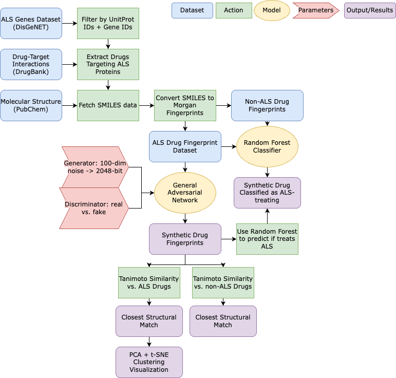

# Cheminformatics-Based Drug Repurposing for ALS using Random Forest Classifier and GAN Model

This project applies cheminformatics and machine learning to accelerate drug repurposing for Amyotrophic Lateral Sclerosis (ALS), a fatal neurodegenerative disorder. By combining a Random Forest classifier and a Generative Adversarial Network (GAN), the pipeline generates synthetic candidates with structural similarity to ALS-targeting compounds.

---

## 🧠 Motivation

ALS is a rapidly progressive and fatal disease. Traditional drug discovery is often too slow to meet the urgent therapeutic needs of ALS patients. Drug repurposing offers a faster and more cost-effective path to treatment by identifying new uses for existing drugs. This project leverages open biomedical databases and machine learning techniques to explore promising compounds *in silico*.

---

## ⚙️ Project Overview

The system performs the following steps:

1. Extract ALS-relevant gene targets from **DisGeNET**
2. Identify drug-target mappings from **DrugBank**
3. Fetch molecular structures from **PubChem** in SMILES format
4. Convert SMILES into 2048-bit **Morgan fingerprints** using **RDKit**
5. Train a **Random Forest classifier** to distinguish ALS-related drugs
6. Train a **GAN** to generate novel drug-like fingerprints
7. Evaluate synthetic drugs using:
   - RF classifier predictions  
   - **Tanimoto similarity** to real ALS drugs  
   - PCA and t-SNE clustering

[](outputs/figures/Pipeline.png)

---

## 📊 Results

- **Random Forest classifier** achieved 91.2% overall accuracy  
- **All 10 GAN-generated fingerprints** were predicted as ALS drugs  
- Structural similarity (Tanimoto score ~0.214) to **Omaveloxolone**, a drug used to treat Friedreich's ataxia  

## Report and Presentation
- [📝 Final Report (PDF)](report/final_report.pdf)
- [📊 Presentation Slides (PDF)](report/presentation_slides.pdf)

---

## 📁 Project Structure

```text
├── data/         # Raw and processed data folders, plus download instructions
│   ├── raw/      # Instructions for downloading original data (not included)
│   └── processed/ # Processed datasets (excluded from repo via .gitignore)
│
├── src/          # Python scripts for preprocessing, training, and evaluation
│   ├── data_prep.py
│   ├── encode_fps.py
│   ├── train_rf.py
│   ├── train_gan.py
│   └── evaluate.py
│
├── models/       # Placeholder for trained model weights (not tracked)
├── outputs/      # Figures, visualizations, and evaluation results
│   └── figures/  # PCA, t-SNE, feature importance plots, etc.
│
├── report/       # Final PDF report and presentation slides
├── requirements.txt
└── README.md     # Project overview and usage instructions
